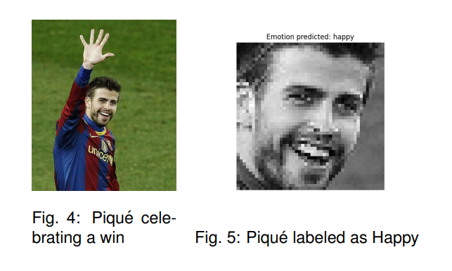

# Facial Expression Recognition using State of Art Techniques

## Abstract

Facial Expression Recognition (FER) has gained significant attention in recent years due to its various applications in areas such as mental health, advertising, security, and entertainment. This article presents a review of the state of the art in FER and proposes a solution using both conventional and deep learning techniques. The conventional method involves image preprocessing, feature extraction using Local Binary Patterns (LBP) and Histogram of Oriented Gradients (HOG), and classification using Random Forest. The deep learning approach utilizes a custom Convolutional Neural Network (CNN) architecture. The proposed solution is evaluated using the Fer2013 dataset and achieves promising results.

## Methods

For our implementation, we proposed a two-fold approach. First, we implemented a conventional method using LBP and Histogram of Oriented Gradients (HOG) as feature extractors, and Random Forest as the classifier. We evaluated the performance of different feature extractors and observed signs of overfitting, which we tried to address by adjusting parameters. Our best-performing model achieved an accuracy of 39.74%.

In addition to the conventional method, we developed a custom CNN architecture using the Keras framework for deep learning-based FER. The CNN consisted of convolutional layers for feature extraction and fully connected layers for classification. We compared the performance of our custom CNN with a pre-existing CNN architecture, aiming to gain insights into the effectiveness of different models tailored to FER.

## Conclusions

In conclusion, this project has provided us with valuable knowledge and experience in the field of FER. We have explored and implemented both conventional and deep learning techniques, evaluated their performance, and gained insights into their strengths and limitations. Moving forward, we believe that further research and experimentation in FER will continue to advance the field and contribute to its applications in mental health, advertising, security, and entertainment.

[Link to PDF of Scientific Paper](Facial_Expression_Recognition_using_State_of_Art_techniques.pdf)
